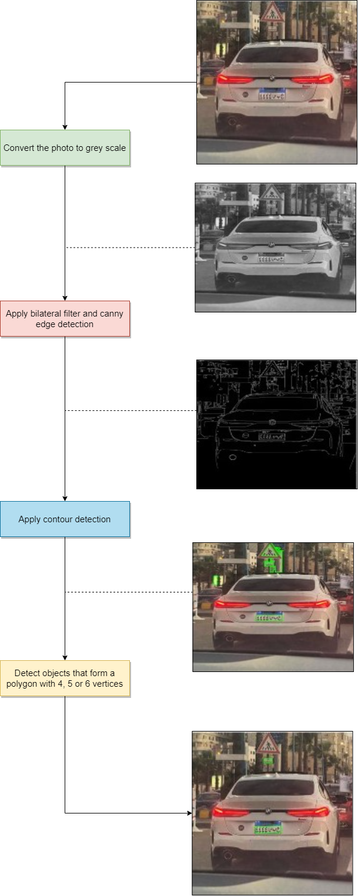
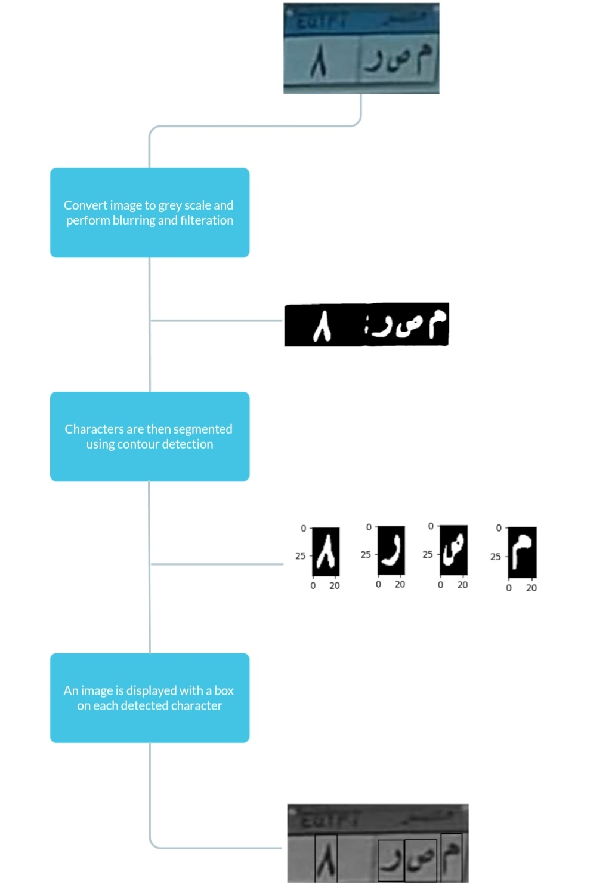
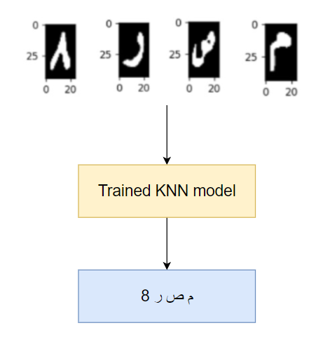
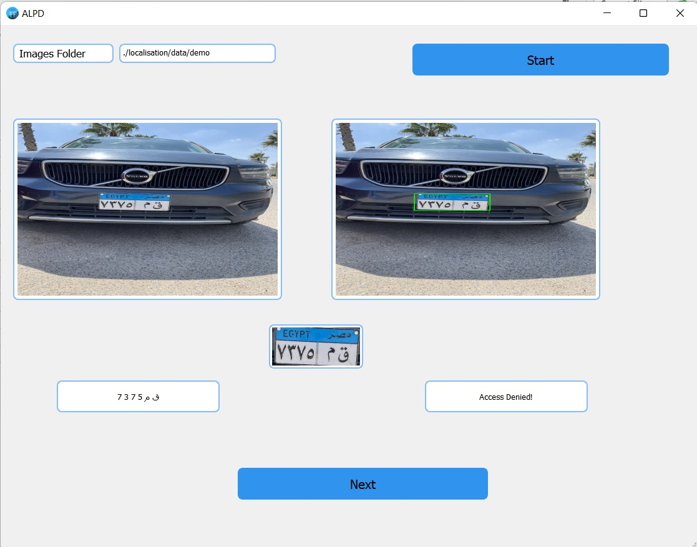
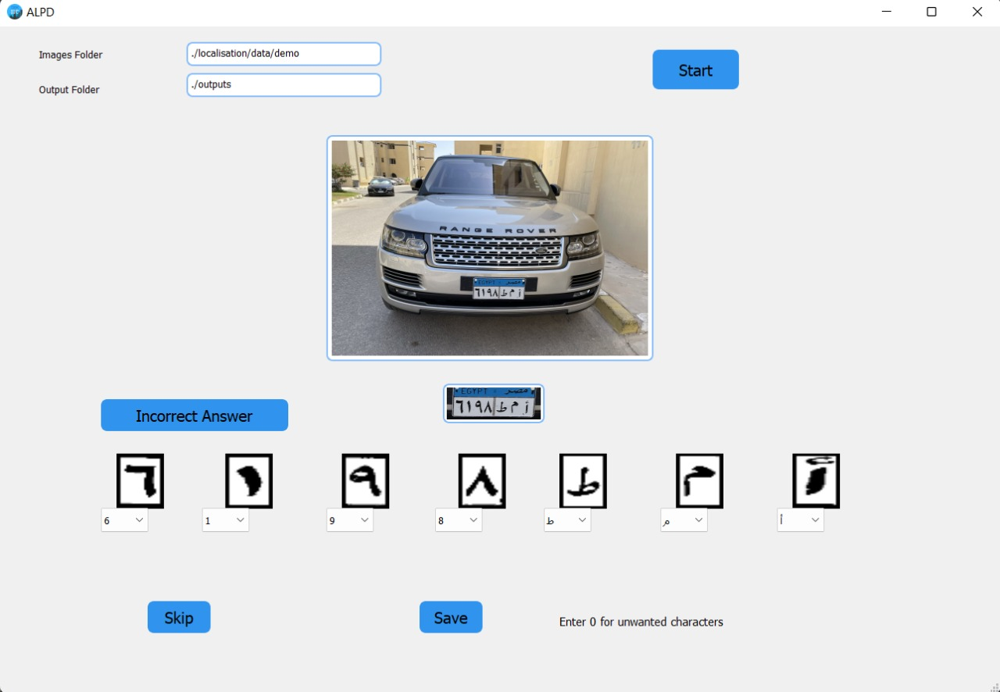

### Arabic License Plate Detector


## 📝 Table of Contents

- [Description](#-description)
- [Localisation](#localisation)
- [Segmentation](#segmentation)
- [Recognition](#Recognition)
- [Applications Demo](#applications-demo)
    - [Front App](#front-app)
    - [Labeling Tool](#labeling-tool)
    - [Streaming App](#streaming-app)

- [Get started](#-getting-started)
  - [Prerequisite](#prerequisite)
  - [Installation](#installation)
  - [Running](#running-applications)
- [Contributors](#contributors)

##  📙 Description 


This projects simulates a smart city's gate to facilitate residents and visitors access using license plate detection. This process is done in three phases. First is localisation, where we get a cropped image of the plate only. Next is segmentation, Where each character is split apart from the other to aperient the character recognition phase. Finally, Character recognition, This phase results in the license plate's characters in the form of string in which you are granted access or not based upon.

## Localisation

<p align="center">
  

## Segmentation

<p align="center">
  

## Recognition
A KNN model is trained on recognizing Arabic Chracters and numbers using segmented characters images. The trained model takes segmented characters as input then outputs the plate's string.
<p align="center">
  
  <br><br>

## 📷Applications Demo
- ## Front App
The front app is used to simulate the smart city's gate, You must have a folder containing cars images with Egyptian license plates. Put the folder's path in Images Folder and the result will look like this. 
<p align="center">
  
  <br><br>

- ## Labeling Tool
This tool is used to increase accuracy and help with character labeling, Where you can click on "Incorrect Answer" if the result is incorrect and you'll get the accuracy percentage at the end. You can either choose save or skip, if you click save, an image of each character will be saved in a folder with a number according to its position in arabic alphabet. If a character is wrong you can modify it using the drop down menu, and save it for further improvements.

<p align="center">
  
  <br><br>

- ## Streaming App
The streaming app  allows you to stream a live feed from your mobile phone remotely using IP broadcast. Once you capture an image it goes through the pipeline.

<p align="center">

  


## 🏁 Getting Started
### Prerequisite 

1. Install Python
2. Install packages in **requirements.txt** using pip
3. Any Python IDE 

### Installation 

1. **_Clone the repository_**

```sh
$ git clone https://github.com/IShamss/Arabic-ALPD.git
```

2. **_Right click on the folder and open it with the IDE_**

### Running Applications
***Install Packages***
```
pip install requirments.txt
```
**Front App**
```sh
python FrontApp.py
```
**Labeling Tool**

```sh
python LabelingApp.py
```
**Streaming App**

```sh
python Streaming.py
```

# Contributors

<table>
  <tr>
    <td align="center">
    <a href="https://github.com/OmarRiad" target="_black">
    
    <br />
    <sub><b>Omar Riad</b></sub></a>
    </td>
    <td align="center">
    <a href="https://github.com/yehiaragab" target="_black">
    
    <br />
    <sub><b>Yehia Ragab</b></sub></a>
    </td>
    <td align="center">
    <a href="https://github.com/IShamss" target="_black">
    
    <br />
    <sub><b>Muhammed Shams</b></sub></a>
    </td>
    <td align="center">
    <a href="https://github.com/ZiadSheriif" target="_black">
    
    <br />
    <sub><b>Ziad Sherif</b></sub></a>
    </td>
    <td align="center">
    <a href="https://github.com/AhmedAshraf82" target="_black">
    
    <br />
    <sub><b>Ahmed Ashraf</b></sub></a>
    </td>
 <td align="center">
    <a href="https://github.com/ZiadKhaled5525" target="_black">
    
    <br />
    <sub><b>Ziad Khaled</b></sub></a>
    </td>
    
  </tr>
 </table>

# License

> This software is licensed under MIT License, See [License]() for more information @OmarRiad.


